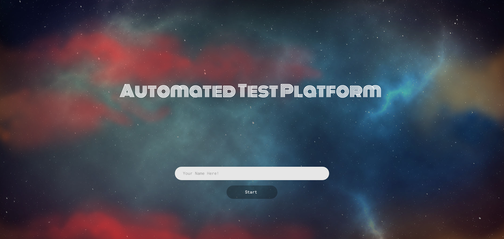

# Automating the Examination System

Conducting examination and answer sheet evaluation are hectic testing tools for assessing
academic achievement, integration of ideas and ability to recall, but are expensive, resource
and time consuming to generate question and evaluate response manually. Manual evaluating
of answer sheet takes up a significant amount of instructors' valuable time and hence is an
expensive process. Also different security concerns regarding paper leakage is one of the other
challenges to conquer. This project aims to build an automated examination system using
machine learning, natural language toolkit (NLTK), python environment, flask framework,
and web technologies to provide an inexpensive alternative to the current examination system.
We implement a model to automatically generate questions with their respective answers and
assess user responses.



## Prerequisites:
    | Flask 0.12 |
    | Numpy 0.10 |
    | Pandas 0.20 |
    | Textblob 0.10 |
    | NLTK 3.3 |
    | Python 3.6 - Anaconda Python Distribution (Recommended)|

## Install Prerequisites:

[How to install anaconda python distribution ?](https://docs.anaconda.com/anaconda/install/)

Setup project environment. Assuming anaconda for python 3 is installed:
```
    $ pip install -r REQUIREMENTS.txt
```

NLTK, Numpy and Pandas comes pre-installed with anaconda python distribution. But any other dependencies will be handeled with the above command.

To donwload NLTK text corpus, initiate the Python 3 environment. Run the following command:
```
    >>> import nltk
    >>> nltk.download("all") # to download nltk corpus
```

## To run the project:
```
To download the project from github - open a terminal and run the following command:
$ git clone https://github.com/nityansuman/automated-test-platform/.git

Now navigate to the root folder of the project from the same termianl:
$ cd automated-test-platform/

Run the following command to execute the project:
$ python runserver.py
```

Once run, it will generate a local url. Copy and paste the url in the web browser. Done!


## Important Links:
* [Natural Language Processing](https://nltk.org/book/)
* [Git](https://git-scm.com/)
* [Github](https://github.com/)
* [NLTK](https://nltk.org/)
* [Flask](http://flask.pocoo.org/)
* [Web Development](https://w3schoo.com/)
* [Python](https://python.org/)
* [Anaconda Python Distribution](https://conda.io)


Drop me a mail or connect with me on [Linkedin](https://linkedin.com/in/kumar-nityan-suman/) .

If you like the work I do, show your appreciation by 'FORK', 'START', or 'SHARE'.
